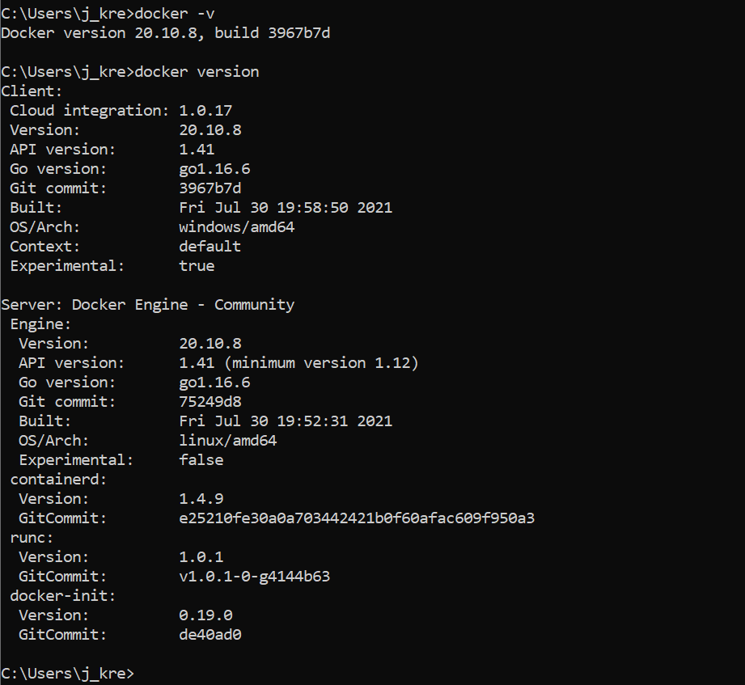
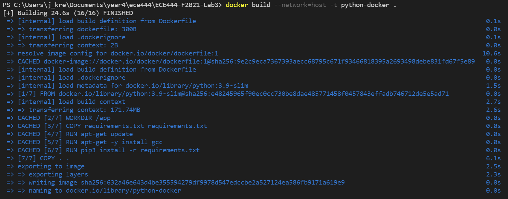
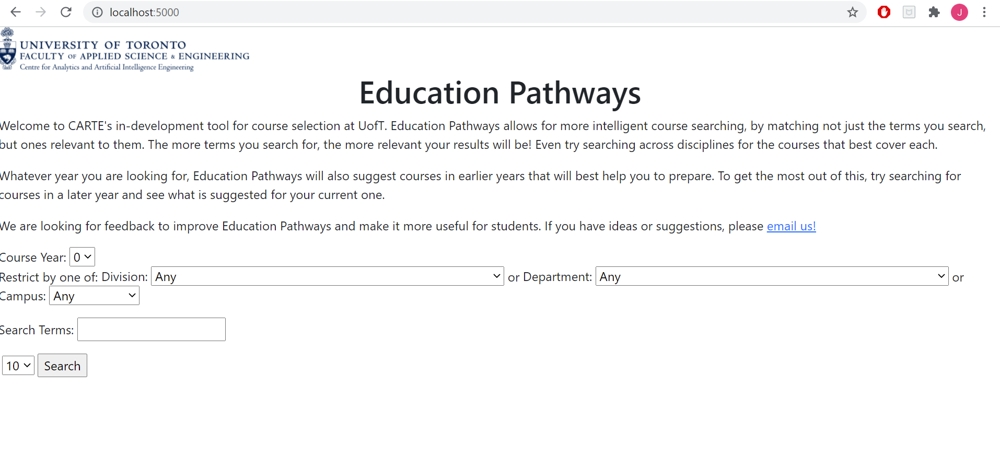
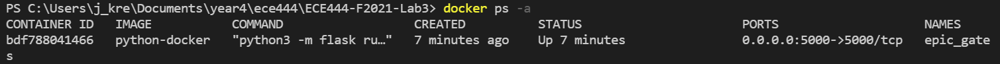

Justin Kreiner

This repo is a clone of https://github.com/nelaturuk/education_pathways.

## Activity 1

## Activity 3

## Activity 4

## Activity 5: Feedback

### Functional Requirement: Saving Courses of Interest

As a student, I would like to be able to save the courses I'm interested so I can revisit them later for enrollment. I would like to improve on Education Pathways by adding a feature where you can save courses and view the list of courses you've saved in one spot.

### Non-functional requirement: Usability

I would like to improve the usability of the Education Pathways application. At a first glance, the web page was not visually appealing since there was minimal styling. After searching for courses via a keyword such as software, it is hard to read the descriptions since there isn't a clear boundary between different list items.

# CARTE Education Pathways

## Description
Welcome to CARTE's in-development tool for course selection at UofT. Education Pathways allows for more intelligent course searching, by matching not just the terms you search, but ones relevant to them. The more terms you search for, the more relevant your results will be! Even try searching across disciplines for the courses that best cover each.

Whatever year you are looking for, Education Pathways will also suggest courses in earlier years that will best help you to prepare. To get the most out of this, try searching for courses in a later year and see what is suggested for your current one.

We are looking for feedback to improve Education Pathways and make it more useful for students. If you have ideas or suggestions, please email us!

## Setup Instructions

### With Docker

## Repository files:

`./Procfile ./wsgi.py` *tells gunicorn how to run the program*

`./environment.yml  ./requirements.txt` *specifies python requirements for anaconda and pip respectively*

`./__init__.py` *main flask code*

`./readme.md` *this file*

`./resources:` *contains datasets used in the program*

`course_vectorizer.pickle df_processed.pickle`

`course_vectors.npz       graph.pickle`

`./static:` *contains any static elements of the webpage, in this case just the CARTE logo*
`CARTE_logo.jpg`

`./templates:` *contains flask templates for rendering HTML*

`_formhelpers.html course.html       index.html        results.html`
